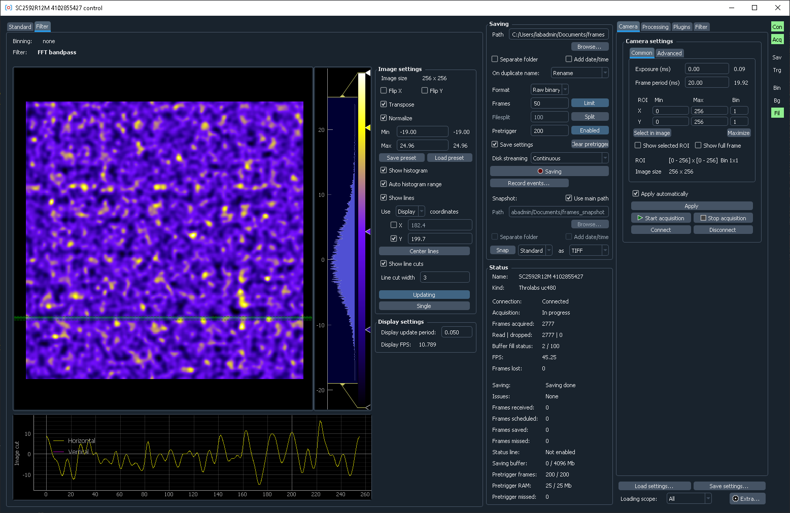

PyLabLib cam-control: Software for universal camera control and frames acquisition
==================================================================================

PyLabLib cam-control aims to provide a convenient interface for controlling cameras and acquiring their data in a unified way.

Features:

- Communication with a variety of cameras: Andor, Hamamatsu, Thorlabs, PCO, PhotonFocus with IMAQ and Silicon Software frame grabbers.
- Operating at high frame (>50 kFPS) and data (>300 Mb/s) rates.
- On-line data processing and analysis: :ref:`binning <pipeline_prebinning>`, :ref:`background subtraction <pipeline_background_subtraction>`, simple built-in :ref:`image filters <advanced_filter>` (Gaussian blur, Fourier filtering), :ref:`playback slowdown <advanced_slowdown>` for fast process analysis.
- Customization using :ref:`user-defined filters <expanding_filter>` (simple Python code operating on numpy arrays) or control from other software via a :ref:`TCP/IP interface <expanding_server>`.
- Flexible data acquisition: :ref:`pre-trigger buffering <pipeline_saving_pretrigger>`, initiating acquisition on :ref:`timer, specific image property <advanced_save_trigger>`, or :ref:`external software signals <expanding_server>`.

To install cam-control, download the latest version from `GitHub <https://github.com/AlexShkarin/pylablib-cam-control/releases/latest/download/cam-control.zip>`__ as a self-contained Zip file and then follow further :ref:`instructions <overview_install>` for how to run it.

.. toctree::
   :maxdepth: 2
   :includehidden:
   :caption: Contents:
   
   overview
   pipeline
   advanced
   interface
   expanding
   settings_file
   usecases
   troubleshooting