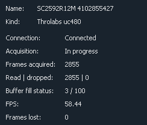
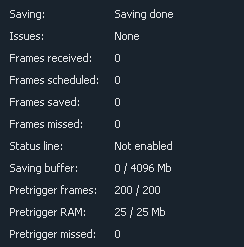
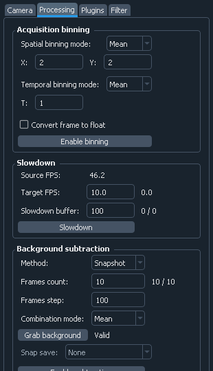
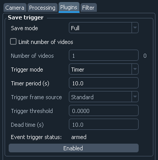
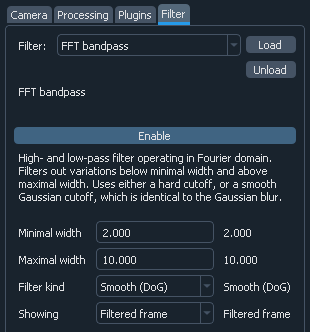

.. _interface:

Detailed interface description
==============================

.. _interface_tutorial:

Tutorial
-------------------------

.. image:: interface_tutorial.png

The first time you start the software, you are greeted with the tutorial. It walks you through the interface and the basic concepts. It is recommended that you take it at some point to get familiar with all of the software capabilities. If you want to revisit it, you can find it under the :ref:`Extra button <interface_extras>`.

.. _interface_camera_settings:

Camera control
-------------------------

.. image:: interface_camera_settings.png

The ``Camera`` tab controls and displays the camera parameters. To reduce the screen space, the settings are split into two categories: ``Common`` and ``Advanced``. The separation is purely cosmetic, and all the settings are treated in exactly the same way.

The settings are applied directly after changing the control. Sometimes (e.g., when using IMAQ frame grabbers at very high frame rates) applying settings might take several seconds, which makes this default behavior annoying. In this cases, one can uncheck ``Apply automatically`` checkbox, so the setting will apply only on pressing ``Apply`` button.

Most parameters have an indicator next to the control, which shows the current parameter state. The state might be different from the entered control value, either when the parameter has not been applied, or if the entered value is out of range, and has to be coerced to the nearest valid value. For example while entering exposure value of 0 is allowed, it is never set exactly to zero, but rather to the lowest possible value given all other parameters.

The settings and their exact behavior vary a bit between different cameras. Below are the most common:

- ``Exposure``: exposure time (in ms)
- ``Frame period``: frame period (in ms). Ultimately determines the camera frame rate (as shown in the status table)
- ``ROI``: region of interest and binning of the camera. ``X`` coordinate is horizontal from the left, ``Y`` coordinate is vertical from the top. For example, to get the bottom half of the 512x512 sensor, one needs to enter ``Xmin=0, Xmax=512, Ymin=256, Ymax=512``. The coordinates are given in raw (un-binned) camera pixels, i.e., full ROI for 2048x2048 sensor with 4x binning corresponds to ``Xmax=Ymax=2048``. Depending on the camera, binning can be independent for two axes, the same for two axes, applied to only one axis, or completely disabled. Hence, one or both of the ``Bin`` controls can be disabled.

  ``Select in image`` button below tje ROI controls on the left lets you select the ROI in the image display by dragging the mouse to select a rectangular region. Note that it only works in ``Standard`` display and not, e.g., in ``Filter`` display. ``Maximize`` button sets the ROI to the full frame, while preserving the binning.
  
  The two checkboxes, ``Show selected ROI`` and ``Show full frame``, display two rectangles in the main image view which show, correspondingly, the currently entered (but not applied) ROI and the whole camera sensor. ``Show full frame`` in combination with ``Select by image`` makes it especially convenient to select ROI relative to the full camera frame.

  In the bottom of ROI controls are two indicators. The first, ``ROI``, shows the actually applied ROI parameters in raw (i.e., un-binned) camera pixels. These can be different from the specified, as cameras often have restrictions on the minimal and maximal size, or the ROI position. The second indicator, ``Image size``, shows the resulting image size, taking binning into account.

- ``Trigger mode`` (on ``Advanced`` tab): allows to set internal/external frame trigger.

The acquisition process is controlled by ``Start Acquisition`` and ``Stop Acquisition`` buttons. At the start of the software, the camera is not acquiring frames.

Finally, ``Connect`` and ``Disconnect`` button control the camera connection. By default, the camera is connected on startup. However, if it is temporarily required in some other software, it can be disconnected, and then re-connected again.

.. _interface_camera_attributes:

Camera attributes
-------------------------

Some cameras such as Andor SDK3, Hamamatsu, Photometrics and Princeton Instruments support camera attributes in their API. In principle, they provide almost complete control over camera's hardware, but their selection, naming and meaning varies a lot between different manufacturers and event different camera models. Therefore, the software provides a generic interface to access these attributes, but does not guard about potential errors arising due to improper settings, which can include the software shutdown if, e.g., the settings interfere with the readout parameters. Hence, one needs to be somewhat careful when using these, and expect potential issues.

Th attributes window is accessed via ``Show attributes`` button in the advanced camera settings. It has two tabs. The first one gives access to the attribute values. In it the first columns (``Attribute``) shows the attribute name, the next one (``To set``) lets you select a new attribute value (the control is absent if the attribute is read-only), which is followed by a ``Set`` button, which sets the attribute after entry, and the indicator showing the current attribute value. Finally, if setting the attribute resulted in an error, it will be indicated in the last column, with the explanation appearing when the mouse is hovered over.

The second tab defines some of the attributes behavior. The first control, ``On set``, describes how the acquisition is affected during the attribute settings. It can be ``Clear``, which means that it is temporarily stopped and the frame buffer is cleared (the safest but also the slowest option), ``Restart``, in which the acquisition is stopped but the buffer remains allocated (this is somewhat faster but, among other things, requires the frame size to remain constant), and ``None``, meaning that the camera acquisition is not affected (the fastest, but not supported by all cameras).

The second control, ``Autoset``, defines when the attribute is set. It can be ``None`` (only set when the ``Set`` button is pressed), ``Startup`` (set on the software setup to, e.g., set up some basic parameters), or ``Always`` (set on startup and any time the entered value is changed).

Finally, ``Quick access`` cna select whether the attribute should show up in the "quick access" mode. Since there are tens or even hundreds of attributes, and only a handful of them are usually relevant, there's a "quick access" mode enabled by a checkbox in the lower left corner, which switches to showing only the marked attributes. This provides more convenience in dealing with the same recurring set of attributes.

.. _interface_camera_status:

Camera status
-------------------------

The top half of the status table deals with the camera status:

- ``Name``: camera name, as defined in the settings file
- ``Kind``: camera kind; usually, the camera interface kind, e.g., ``Andor iXON`` or ``Thorlabs uc480``
- ``Connection``: shows whether camera is connected or not. Normally the camera should always be connected. It is only disconnected if it has been disconnected manually (by pressing ``Disconnect`` button on the camera control), or if the software couldn't connect to the camera on the startup. The latter usually means that the camera is turned off, disconnected, or used by a different program
- ``Acquisition``: acquisition status
- ``Frames acquired``: number of frames acquired by the camera in the current acquisition session, i.e., since the last press of the ``Start Acquisition`` button or the last change of parameters
- ``Read / dropped``: number of frames which have been successfully read from the camera and, correspondingly, lost in transmission. Ideally the dropped frames counter is always zero, which means that the number of read and acquired frames is the same.
- ``Buffer fill status``: status of the camera frame buffer; shows number of unread frames in the buffer and the total number of frames in the buffer
- ``FPS``: calculated camera frame generation rate
	
Frames buffer, and the difference between acquired and read frames require some explanation.

Typically, after the camera acquires a frame and sends it to the PC, the camera driver places it into RAM almost immediately. However, the software working with the frames can't guarantee to react to each frame individually and quickly enough before the next frame arrive. To deal with that, the camera driver allocates a large area of RAM (called a buffer), where it places all the acquired frames in sequence. Afterwards, when the user software checks for new frames, it can read multiple frames acquired since the last check, and deal with all of them in one go. In other words, it can process acquired frames in "bursts", keeping the required throughput (total number of processed frames per second), but reducing the required reaction time and frequency of checks for the new frames.

However, this only works if the buffer doesn't overflow between the checks, i.e., if the number of frames acquired since the last check doesn't exceed the size of the buffer. If that happens, some of the acquired frames will be lost, which causes the difference between acquired frames (frames read by the camera and placed into the buffer), and the read frames (frames extracted from the buffer and sent further down the road). Hence, at high frame rates and high data rates it is important to monitor the buffer fill status and make sure that the buffer is not too full, and especially that the buffer fill level is not steadily rising.

.. _interface_image_view:

Image display
-------------------------

.. image:: interface_image_display.png

The image control is based on `pyqtgraph <http://www.pyqtgraph.org/>`_ ``ImageView`` control, which is used for displaying the image and the intensity histogram. In addition, there are some controls to change the image appearance and to enable additional features:

- ``Binning``, ``Background subtraction``, ``Filter`` (above the image): quick overview of all processing steps for the displayed frame
- ``Image size``: displays image size in pixels
- ``Flip X``, ``Flip Y``, ``Transpose``: correspondingly, flips the image along the given axis, or transposes it (flips along the diagonal); note that these settings only affect display, and do not change the way images are saved
- ``Normalize``: controls whether the image levels are automatically normalized to cover the full image range, or if they stay fixed
- ``Min``, ``Max``: minimal and maximal intensity levels, if ``Normalize`` is off
- ``Save preset``, ``Load preset``: it is possible to store a single "preset" combination of intensity levels and recall them later; can be used to, e.g., temporarily switch to the ``Normalize`` mode to assess the whole image, but then quickly switch back to the previously used levels
- ``Show histogram``: controls whether the image value histogram on the right is shown; turning it off gives more space to the image and somewhat improves the update rate
- ``Auto histogram range``: controls whether the histogram plot is rescaled with every new frame; this is different from the ``Normalize`` option, which control whether the image level range (shown with a transparent box in the histogram) gets similarly rescaled
- ``Show lines``: controls whether the green cross is shown in the plot; it can be used to mark or extract positions of features in the image
- ``Use <name> coordinates``: controls the coordinate system used for the lines. By default the included systems are ``Display`` (display image coordinates after applying flipping and rotations), ``Image`` (image coordinates, before flipping and rotations), and ``Frame`` (camera frame coordinates, which account for ROI and binning settings; only available in the ``Standard`` image display).
- ``X``, ``Y``: enable or disable individual lines and control their positions in the specified coordinate system. The lines can also be moved in the plot, or centered to a given position with a double-click.
- ``Center lines``: move the cross to the center of the images
- ``Show line cuts``: when activated, shows a small additional plot with line cuts along the displayed lines
- ``Line cut width``: if more than 1, it specifies a band thickness to average for a single line cut; this might reduce noisiness of the cuts
- ``Updating``: controls whether the image view updates on the new frames, or simply shows the last frame; can be used to improve performance, or to closer inspect a single image
- ``Single``: when pressed, grabs a single image and stops updating
- ``Display update period``: maximal image update period. Can be increased if the software is to laggy, e.g., if large frames or large data rates are used.
- ``Display FPS``: actual display update frame rate.

The colored gradient bar in the intensity histogram shows the current color scheme and allows to change it. It can be done either by right-clicking on it and selecting one of the presets, or manually adding, dragging, and changing color of the markers.

.. _interface_save_control:

Saving control
-------------------------

.. image:: interface_save_control.png

Here the :ref:`saving <pipeline_saving>` parameters, such as path, format, and number of frames to save, are controlled:

- ``Path``: path for saving the frames. If the containing folder does not exist, it is created automatically; if the extension is not specified, it is added automatically. Note that if ``Add date/time`` is activated, the actual path will be somewhat different.
- ``Separate folder``: if activated, then the supplied path is treated as a folder, and all of the data is stored inside under standard names (``frames.bin`` or ``frames.tiff`` for main frames data, ``settings.dat`` for settings, etc.) This option allows for better data organizing when each dataset has multiple files (e.g., main data, settings, frame info, background, several split files).
- ``Add date/time``: if activated, create a unique name by appending current date and time to the specified path. By default, the date and time are added as a suffix, but this behavior can be changed in the :ref:`preferences <interface_preferences>`.
- ``On duplicate name``: determines what happens if the files with the specified name already exists; can be ``Rename`` (add a numeric suffix to make a new unique name), ``Overwrite`` (overwrite the existing data), or ``Append`` (append the existing data)
- ``Format``: saving format; so far, only raw binary, tiff, and big tiff (BTF) are supported
- ``Frames limit``: if activated, only save the given number of frames; otherwise, keep streaming data until saving is manually stopped
- ``Filesplit``: if activated, saved frames are split into separate files of the specified size instead of forming a single large file; this is useful when continuously acquiring very large amounts of data to avoid creating huge files
- ``Pretrigger``: set up the :ref:`pretrigger <pipeline_saving_pretrigger>` buffer size
- ``Clear pretrigger``: clear the accumulated pretrigger buffer
- ``Save settings``: if checked, then in addition to the frame saves a text file containing all of the related information: camera settings, GUI state, frame counters, frame shape and data format, etc. Highly recommended to use.
- ``Disk streaming``: selects the way of data streaming to the disk. ``Continuous`` is as described in the :ref:`saving buffer <pipeline_saving_buffer>` explanation, with frames being constantly streamed to the disk as quickly as possible while the overhead is stored in the buffer. Alternatively, ``Single-shot`` mode does not write data during acquisition, but only starts streaming to the disk after the necessary number of frames has been accumulated (or the saving has been stopped manually). Unlike the ``Continuous`` mode, it can not work indefinitely, since its stores in RAM all the data to be saved. However, for very high-performance cameras working at >1Gb/s (e.g., Photometrix Kinetix) this mode is more reliable and has lower chances of dropping frames during acquisition.
- ``Saving``: the main button which initiates and stops data streaming; while streaming, changing of any other saving parameters is not allowed
- ``Record events...``: opens a small window which lets one record various events during data acquisition. The events are tagged by the global OS timestamp, time since the recording start, and the frame number. The event file is automatically created when the first message is added.
- ``Snapshot``: :ref:`snapshot <pipeline_saving_snapshot>` saving parameters
- ``Use main path``: if checked, snapshot image path will be the same as the main image path, just with ``_snapshot`` appended to the end; all of the modifying parameters (``Separate folder`` and ``Add date/time``) are also the same
- ``Path``, ``Separate folder``, ``Add date/time``: same meaning as above, but applied to the snapshot saving; only active if ``Use main path`` is not checked.
- ``Snap``: pressing it saves a single  image from the specified source (usually either ``Standard`` or ``Filter``) in the specified image format

.. _interface_save_status:

Saving status
-------------------------

The bottom half of the status table deals with the saving status:

- ``Saving``: saving status; can be ``Saving in progress`` during the saving process, ``Finishing saving`` when finishing writing the data to the hard drive, or ``Saving done`` when done.
- ``Frames received``: number of frames received for saving during the current saving session
- ``Frames scheduled``: number of frames which have been scheduled for saving to the drive
- ``Frames saved``: number of frames stored to the drive
- ``Frames missed``: number of frames which were missed in saving; this includes both frames that were received but not saved (e.g., due to save buffer overfill) and frames missed on camera readout
- ``Status line``: some cameras provide a status line within their frames (currently only PhotonFocus is supported). This status line allows one to do the last-minute check of the frames consistency, whose results are shown here.
- ``Saving buffer``: fill status of the :ref:`save buffer <pipeline_saving_buffer>` and its maximal size in Mb. This maximal size can be changed in :ref:`preferences <interface_preferences>`.
- ``Pretrigger frames``: fill status of the :ref:`pre-trigger buffer <pipeline_saving_pretrigger>`
- ``Pretrigger RAM``: same as ``Pretrigger frames``, but expressed in memory size; useful to keep an eye on it in case the requested pre-trigger buffer size gets too large
- ``Pretrigger skipped``: number of skipped frames in the pre-trigger buffer, which arose during the camera readout

.. _interface_activity:

Activity overview
--------------------------

In the upper right corner you can find indicators for the basic software activities: camera connection and acquisition, saving, background subtraction, filters, etc. These give a fast overview and help to, e.g., notices that some process is stopped (e.g., saving is done), or if it uses resources unnecessarily (e.g., running filters).

.. _interface_footer:

Settings saving and extras
--------------------------

.. image:: interface_footer.png

The small box in the lower right corner allows to save the application settings to a file and subsequently load them. This lets you quickly switch between several working modes. ``Loading scope`` selects the loaded settings scope: only camera settings, everything except for the camera, or all settings.

If you want to only load some of the settings, you can manually edit saved settings files. It is a human-readable table, and the parameter names are relatively straightforward to decipher. Note that you can also load settings from the ``*_settings.dat`` file accompanying the saved data, as long as it was obtained using the same version of the software. This may be useful to make sure that you save the data with exactly the same parameters as before.

.. _interface_extras:

Extras
--------------------------

.. image:: interface_extras.png

The ``Extra...`` button in the :ref:`footer <interface_footer>` contains additional infrequently used features:

- ``Tutorial``: interface and operation :ref:`tutorial <interface_tutorial>`, which automatically shows up during the first run of the software
- ``Create camera shortcut``: if there are multiple cameras, this button allows to create a shortcut which connects to a particular camera. This skips the camera selection window on the application start and immediately runs the specific camera.
- ``Preferences``: opens the :ref:`settings and preferences editor <interface_preferences>`.
- ``About``: opens the ``About`` window with the version information and useful links.

.. _interface_preferences:

Settings and preferences
-------------------------

.. image:: interface_preferences.png

The preferences window can be opened using the :ref:`Extras <interface_extras>` button. Here you can edit the general software settings. These cover all the same items as the :ref:`settings file <settings_file>`, but provides a user-friendly interface for editing these settings. This windows has several tabs. The first tab controls general settings, which affect all cameras by default. The other tabs (one per cameras) allow you override these settings for specific cameras (e.g., choose different color schemes for different cameras), as well as control some camera-specific settings. Here are the generic settings:

- ``Compact interface``: switche between the standard four-panel and the more compact three-panel layouts.
- ``Color theme``: select different interface and color therems (based of `qdarkstyle <https://github.com/ColinDuquesnoy/QDarkStyleSheet>`__).
- ``Expandable text boxes``: enable or disable expandable text boxes for paths and event logs.
- ``Add date/time file method``: method to generate file names when ``Add date/time`` is selected but ``Create separate folder`` is not. Can be ``Prefix`` (add date as a prefix, e.g., ``20210315_120530_video.bin``), ``Suffix`` (add date as a suffix, e.g., ``video_20210315_120530.bin``), or ``Folder`` (create folder with the datetime as name, e.g.,  ``20210315_120530/video.bin``).
- ``Add date/time folder method``: same but when both ``Add date/time`` and ``Create separate folder`` are selected.
- ``Max saving buffer RAM (Mb)``: maximal size of the saving buffer in megabytes. Makes sense to increase if large movies are saved to slow drive, or if large pre-trigger buffer is used (the size of the saving queue must be larger than the pre-trigger buffer). Makes sense to decrease if the PC has small amount of RAM.
- ``Popup on missing frames``: whether to show a pop-up message in the end of saving if the saved data contains missing frames.
- ``Status line display policy``: method to deal with a status line (on PhotonFocus or PCO edge cameras) when displaying frames. Only affects the displayed image.
- ``ROI entry method``: ROI entry method in camera control. Can be ``Min-Max`` (enter minimal and maximal coordinates), or ``Min-Size`` (enter minimal coordinates and size).

In addition, there are several camera-specific parameters:

- ``Camera name``: the name associated with the camera, which is displayed in the window title, camera status, or in the dropdown menu during camera selection. By default, autogenerated based on the camera model and serial number.
- ``Frame buffer (frames)``: minimal camera frame buffer size defined in terms of number of frames.
- ``Frame buffer (s)``: minimal camera frame buffer size defined in terms of acquisition time (in seconds). For example, the size of 1 second would be result in 100 frame for 100 FPS frame rate and 1000 frames for 1 kFPS frame rate.
- ``Poll period (s)``: the period at which camera is polled for new frames. Lower period increases the image update frame rate, but might decrease the overall performance.

.. _interface_processing:

Processing controls
-------------------------

The top half of the ``Processing`` tab controls :ref:`pre-binning <pipeline_prebinning>`, :ref:`slowdown <advanced_slowdown>`, and :ref:`background subtraction <pipeline_background_subtraction>`:

- ``Acquisition binning``: controls pre-binning
  
  - ``Spatial binning mode``: determines the mode of the spatial (i.e., within-frame) binning, which reduces the frame size
  - ``X`` and ``Y``: binning factor along the two directions
  - ``Temporal binning mode``: determines the mode of the temporal binning, which reduces the frame rate
  - ``T``: temporal binning factor
  - ``Convert frame to float``: if checked, the frames fed to later stages (including saving) are converted to float instead of staying as integer; useful when ``Mean`` or ``Sum`` binning modes are used
  - ``Enable binning``: enables or disables the binning 

- ``Slowdown``: controls the display slowdown

  - ``Source FPS``: displays the current frame rate; normally it is equal to the camera FPS divided by the temporal binning factor
  - ``Target FPS``: reduced frame rate; the slowdown factor is then roughly equal to the ratio of the source to the target FPS
  - ``Slowdown buffer``: size and current status of the slowdown buffer; the status shows the number of already displayed frames from the buffer and the total number of frames acquired so far, while the edit box control the maximal size of the buffer
  - ``Slowdown``: enables or disables the slowdown

- ``Background subtraction``: controls the background subtraction options

  - ``Method``: subtraction method, which can be ``Snapshot`` (a single fixed frame) or ``Running`` (dynamically generated from some number of previous frames)
  - ``Frames count``: number of frames to combine for the background
  - ``Combination mode``: method of combining the frames; note that ``Median`` works significantly slower than all other methods, and should be avoided for large frame counts (typically, above 100-1000 frames) in the ``Running`` mode
  - ``Grab background``: if ``Snapshot`` method is used, pressing it initializes the new snapshot background acquisition; while it is in progress, ``Frames count`` status shows the number of frames acquired so far
  - ``Snap save``: determines whether the snapshot background is saved together with the main data; only active when ``Snapshot`` method is used and the subtraction is active
  - ``Enable subtraction``: enable or disable the background subtraction

.. _interface_time_plot:

Time plot
-------------------------

This part controls the :ref:`time series plotting <advanced_time_plot>`:

- ``Enable``: enable or disable the time series plot
- ``Source``: plot source; can be either ``Display frames`` or ``Raw frames``
- ``Calculate every``: if raw frames are used, the averaging might be computationally expensive for high frame rates; this parameter allows to average only some frames with the given periodicity
- ``Use ROI``: enable or disable averaging in a given region of interest (ROI); if disabled, average the whole frame
- ``Center``, ``Size``: controls the averaging ROI
- ``Reset ROI``: reset ROI to the full frame
- ``Update plot``: enable or disable plot update
- ``Display last``: number of points to display
- ``Reset history``: reset the displayed points

.. _interface_saving_trigger:

Saving trigger
-------------------------

The top part of the ``Plugins`` tab controls the :ref:`saving trigger <advanced_save_trigger>`:

- ``Save mode``: the kind of saving that happens on the trigger; can be ``Full`` (standard saving, equivalent to pressing ``Saving`` button) or ``Snap`` (snapshot saving, equivalent to pressing ``Snap`` button)
- ``Limit number of videos``: if enabled, limits the total number of saved videos
- ``Number of videos``: maximal number of saved videos; the indicator shows the number saved so far
- ``Trigger mode``: the source of the trigger; can be ``Timer`` for periodic timed acquisition or ``Frame`` for a frame-triggered acquisition
- ``Trigger frame source``: the source of the triggering frame, either ``Standard`` for the standard processing pipeline (including background subtraction) or ``Filter`` for the filter frame
- ``Time period (s)``: for timer acquisition, the trigger period
- ``Dead time (s)``: for frame trigger, the amount of dead time, i.e., the time after the trigger when the subsequent triggers are ignored. If the save mode is ``Full``, it is recommended that the period and the dead time are longer than the length of the single movie
- ``Trigger threshold``: frame trigger threshold; the trigger is activated when any image pixel is above this threshold
- ``Event trigger status``: frame trigger status, either ``armed`` (waiting for trigger), ``triggered`` (triggered recently), or ``dead`` (dead time period)

.. _interface_filter:

Filter
-------------------------

The ``Filter`` selects the :ref:`filter <advanced_filter>` and controls its parameters:

- ``Filter``: selected filter to load; currently loaded and active filter is shown above the ``Enable`` button
- ``Load``: load the selected filter, or reload if it is already loaded; reloading can be used to, e.g., clear the accumulated frames in the buffer
- ``Unload``: unload the filter
- ``Enable``: enable or disable the filter; note that while it stops frames from being fed to the filter, it preserves all of the accumulated data

Below this button is the filter description and the list of filter parameters and indicators. Both depend on the exact filter.