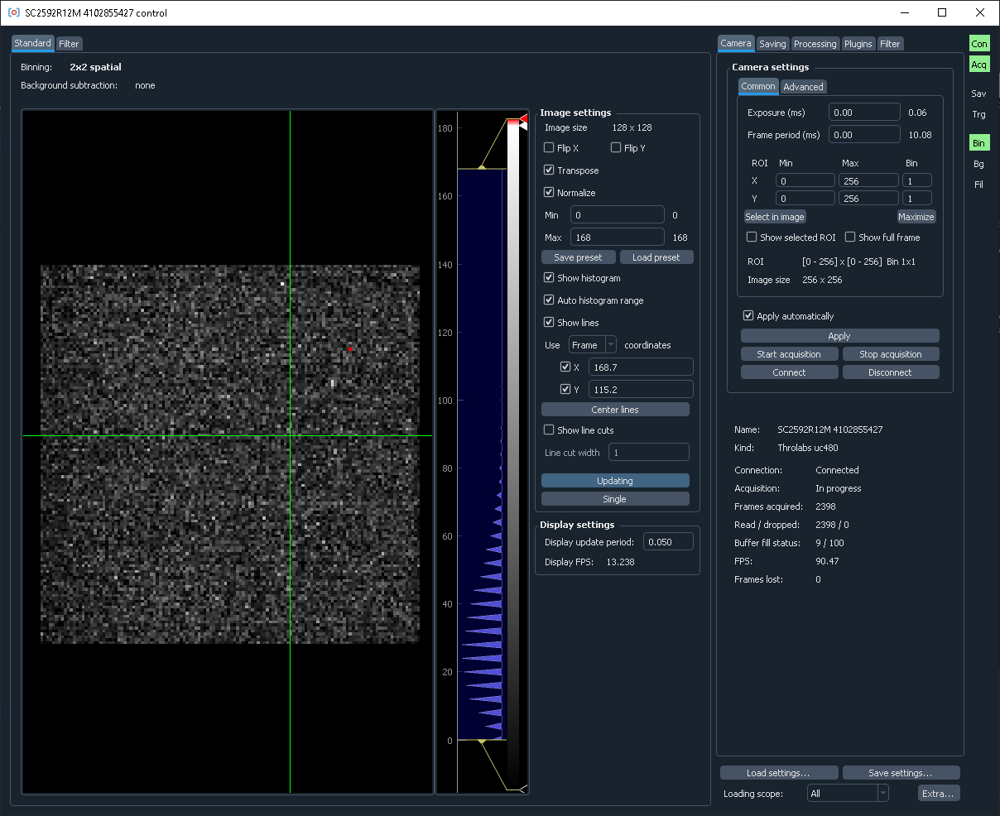

.. _overview:

Overview
=========================

.. _overview_install:

Installation
------------------------- 

Download the zip file with the `latest release <https://github.com/AlexShkarin/pylablib-cam-control/releases/latest/download/cam-control.zip>`__ and unpack it to the desired location. The software comes with its own isolated Python interpreter with all the basic packages installed, so no additional installations are necessary.

To run the software, simply execute ``control.bat``. On the first run it will attempt to detect all connected supported cameras and store their connection parameters. Make sure that at this point all cameras are connected, turned on, and not used in any other software (e.g., Andor Solis, Hokawo, or NI MAX). If new cameras are added to the PC, they can be re-discovered by running ``detect.bat``.

If only one camera is found, running ``control.bat`` will automatically connect to it. Otherwise, a dropdown menu will show up allowing selection of specific cameras.

.. _overview_software_requirements:

Software requirements
-------------------------

Cam-control is built using `pylablib <https://github.com/AlexShkarin/pyLabLib/>`__ and includes all of the cameras supported there. All of these cameras need some kind of drivers and API installed:

- Andor cameras: `Andor Solis <https://andor.oxinst.com/products/solis-software/>`__ or `Andor SKD <https://andor.oxinst.com/products/software-development-kit/>`__.
- Hamamatsu/DCAM cameras: Hamamatsu-supplied software such as Hokawo, or the freely available `DCAM API <https://dcam-api.com/downloads/>`__. Keep in mind, that you also need to install the drivers for the corresponding camera type (USB, Ethernet, IEEE 1394). These drivers are in the same installer, but need to be installed separately.
- Thorlabs cameras: freely available `ThorCam <https://www.thorlabs.com/software_pages/ViewSoftwarePage.cfm?Code=ThorCam>`__ software.
- PCO cameras: freely available `pco.camware <https://www.pco.de/software/camera-control-software/pcocamware/>`__ software.
- IMAQdx cameras: all the necessary code is contained in the freely available `Vision Acquisition Software <https://www.ni.com/en-us/support/downloads/drivers/download.vision-acquisition-software.html>`__. However, the IMAQdx part of the software is proprietary, and needs to be purchased to use.
- IMAQ frame grabbers: freely available `Vision Acquisition Software <https://www.ni.com/en-us/support/downloads/drivers/download.vision-acquisition-software.html>`__. In addition, you would also need to specify the correct camera file, which describes the camera communication protocol details.
- Silicon Software frame grabbers: freely available (upon registration) `Silicon Software Runtime Environment <https://www.baslerweb.com/en/sales-support/downloads/software-downloads/#type=framegrabbersoftware;language=all;version=all;os=windows64bit>`__ (the newest version for 64-bit Windows is `5.7.0 <https://www.baslerweb.com/en/sales-support/downloads/software-downloads/complete-installation-for-windows-64bit-ver-5-7-0/>`__).
- PhotonFocus: on top of IMAQ or Silicon Software requirements, it needs freely available (upon registration) `PFInstaller <https://www.photonfocus.com/support/software/>`__ software.

.. note::

    Cam-control is only available in 64-bit version, which in most cases means that you must install 64-bit versions of the software described above.

.. note::

    It is strongly recommended that you install the manufacturer software (especially Andor Solis and ThorCam) into their default locations. Otherwise, cam-control might not be able to find the required DLLs and communicate with the cameras. In this case, you would need to specify the location of the necessary DLLs in the :ref:`settings file <settings_file_system>`.

In most cases, you already have the necessary software installed to communicate with the cameras to begin with. As a rule of thumb, if you can open the camera in the manufacturer-supplied software, you can open it in the cam-control as well.

In rare cases you might also need to install Microsoft Visual C++ Redistributable Package. You can obtain it on the `Microsoft website <https://aka.ms/vs/16/release/vc_redist.x64.exe>`__.

Specifying camera files
~~~~~~~~~~~~~~~~~~~~~~~~~

Cameras using NI-IMAQ frame grabbers also need the correct ``.icd`` camera file for the connected camera, which describes the communication protocol details, sensor size, possible bit depths, etc. Some of the common camera files are already provided when you install Vision Acquisition Software, others need to be obtained from the manufacturer. To specify them, follow the following steps:

1) If you are using a manufacturer-provided file, copy it into the NI-IMAQ camera file storage. By default it is located at ``C:\Users\Public\Documents\National Instruments\NI-IMAQ\Data`` (the folder should already exist and have many ``.icd`` files).
2) Run NI MAX, and there find the camera entry in ``Devices and Interfaces`` -> ``NI-IMAQ Devices`` -> ``img<n>: <Frame grabber name>`` (e.g., ``img0: NI PCIe-1433``) -> ``Channel <n>`` (0 for single-channel frame grabbers).
3) Right-click on the camera entry and there select ``Camera`` -> ``<Manufacturer>`` -> ``<Camera model corresponding to the file>``.

PhotonFocus provides camera files with PFRemote, and they can be found in ``<Photon Focus folder>\PFRemote\fg_files``. There are several files with names like ``pfFg_ni_2tap_8bit.icd``, which should be selected based on the desired bit depth (usually 12 bit is preferable, if it is available for your camera) and the number of CameraLink taps (specified in the technical specification found in the camera manual; e.g., MV1-D1024E-160-CL has 2 taps). After specifying the file, you need to also specify the camera pixel depth using PFRemote. The correct setting is located at ``Data Output`` -> ``Output Mode`` -> ``Resolution``.

.. _overview_layout:

General layout
-------------------------

.. image:: overview.png

The window is split into two parts. The left half shows the images, possibly with several tabs to show several different kinds of images (e.g., if filters are used). The right half controls data saving, shows camera status (in the middle column), and has additional controls for camera, on-line processing, or additional plugins (rightmost column).

The acquisition is started by pressing ``Start acquisition`` button. Note that you might need to adjust camera parameters (e.g., specify exposure, ROI, binning, pixel readout rate) to get reasonable image quality and performance.

All of the entered values are automatically saved on exit and restored on the next restart. It is also possible to :ref:`save the settings to a file <interface_save_settings>` and load them later, which is helpful for working in several different regimes.

In case the interface takes too much space and does not fit in the screen, you can enable the compact mode in the :ref:`settings file <settings_file_general>`.

.. _overview_feedback:

Support and feedback
-------------------------

If you have any issues, suggestions, or feedback, you can either raise an issue on GitHub at https://github.com/AlexShkarin/pylablib-cam-control/issues, or send an e-mail to pylablib@gmail.com.